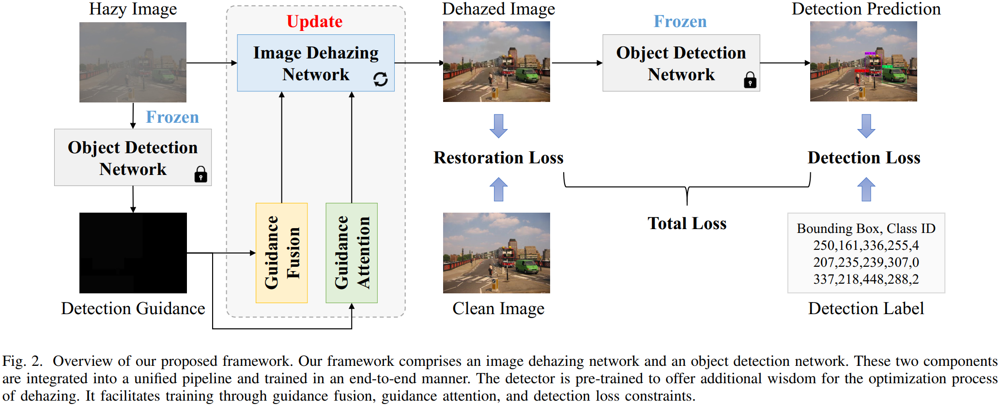

# FriendNet: Detection-Friendly Dehazing Network

This repo is the official implementation of "FriendNet: Detection-Friendly Dehazing Network".




## 📣News

- Mar 7, 2024: Submitted paper. [Link to Paper](https://arxiv.org/pdf/2403.04443.pdf) 

- Mar 20, 2024: Released testing code.

  The training code will be released after the paper is published.


## 💻Getting Started

### Prepare Datasets

Download datasets, and put the whole folder in `data/`.

The file structure of datasets is depicted in the following:

```python
┬─ data
│   ├─ VOC-FOG
│   │   ├─ train
│   │   │   ├─ FogImages
│   │   │   ├─ JPEGImages
│   │   │   └─ Annotations
│   │   └─ test
│   │       ├─ FogImages
│   │       ├─ JPEGImages
│   │       └─ Annotations
│   └─ Foggy-Driving
│       └─ test
│           ├─ FogImages
│           ├─ JPEGImages
│           └─ Annotations
```

The `FogImages` folder contains hazy images, the `JPEGImages` folder contains clean images, and the `Annotations` folder contains detection labels.

Please note that  the formatting of detection labels in the original `Foggy-Driving` dataset differs from that in `VOC-FOG`. We have standardized the formatting among all the datasets. You can use the `convert_Foggy_Driving_to_VOC.py` script for this transformation.


### Prepare Pretrained Models

Download pretrained models, and put them in `checkpoint/`.


### Train

(Optional) Run the following script to parse detection annotations and generate necessary text files for training, namely `train.txt` and `test.txt`: 

```
python convert_VOC_to_txt.py
```

By default, the text files will be saved in `./data/`.   If your dataset structure aligns with ours,  you can directly use the provided text files.

Run the following script to train the model: 

```
python train.py --num_workers=4
```

By default, the weight files along with some log files will be saved in `./logs`. You can modify other arguments if needed.


### Test

Run the following script to test the dehazing model (perform image dehazing and save images):

```
python test_dehaze.py --input_dir=data/VOC-FOG/test/FogImages --output_dir=data/VOC-FOG/test/DehazedImages --dehaze_model_path=checkpoint/best_model.pth
```

If you want to obtain visual results of object detection, run the following script to test the detection model (perform object detection and save images):

```
python predict_detect.py --input_dir=data/VOC-FOG/test/DehazedImages --output_dir=data/VOC-FOG/test/DetectedImages --detect_model_path=checkpoint/yolov7-tiny_clean_best_epoch_weights.pth
```


### Evaluate

Run the following script to evaluate the dehazing performace (compute PSNR and SSIM): 

```
python eval_dehaze.py --image_dir=data/VOC-FOG/test/DehazedImages --gt_dir=data/VOC-FOG/test/JPEGImages
```

Run the following script to evaluate the detection performace (compute mAP): 

```
python eval_detect.py --image_dir=data/VOC-FOG/test/DehazedImages --label_dir=data/VOC-FOG/test/Annotations
```

By default, the detection evaluation results will be saved in `./map_out`.


### Quick Test

We also suggest you define the path to the dataset and the pre-trained model, and then perform quick test to run testing and evaluation code in a row:

```
python quick_test_script.py
```


## 🏅Acknowledgments

Our code is developed based on [gUNet](https://github.com/IDKiro/gUNet) and [yolov7-tiny-pytorch](https://github.com/bubbliiiing/yolov7-tiny-pytorch). We thank the awesome work provided by the authors. And great thanks to the anonymous reviewers for their helpful feedback.


## 📧Contact

If you have any questions or suggestions about our paper and repo, please feel free to concat us via fanyihua@nuaa.edu.cn. 